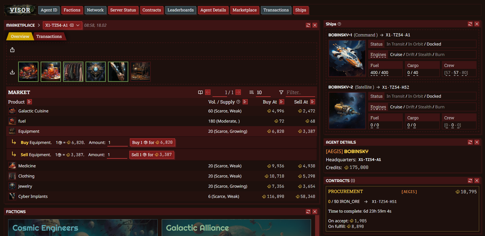
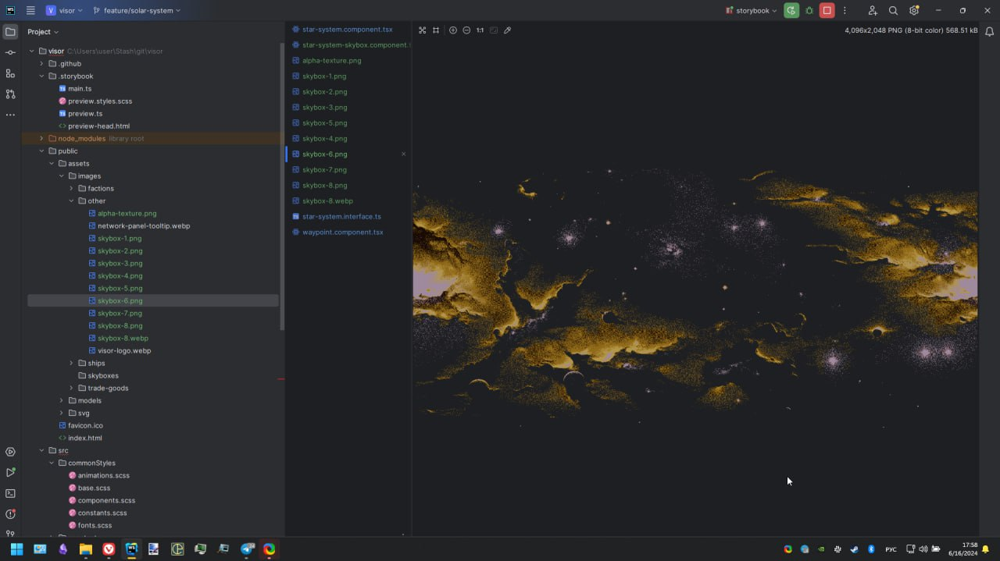
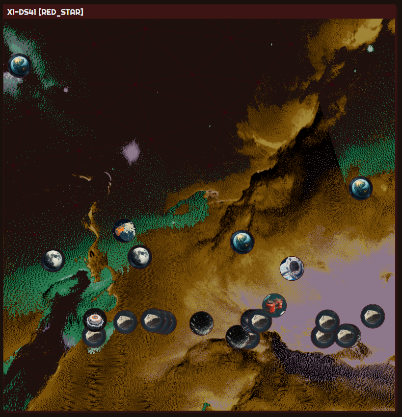

# Visor

Link: [visor.surge.sh](https://visor.surge.sh).

## Showcase

This project is fully vibe-powered. I'm enjoying the process of working and experimenting on it more than actually delivering features.

Consider below imagery a showcase of what I've been working on:

UIs (react & sass).
---

Lightweight stylized skyboxes (Manual post-processing).
---

Adding React components to Three.js scenes.
---

Slick drag&drop and responsive components.

## About

Visor is web-client for [SpaceTraders API](https://spacetraders.io).

Application is built using following technologies in its core:

* [TypeScript](https://www.typescriptlang.org)
* [ReactJS](https://react.dev)
* [ThreeJS](https://threejs.org)
* [Zustand](https://github.com/pmndrs/zustand)

And deployed via [surge](https://surge.sh).

## Credits

Ship images, trade goods, factions images are generated via [Midjourney](https://www.midjourney.com).

Icons are taken from [Phosphor Icons](https://phosphoricons.com).

Typefaces are taken from [Google Fonts](https://fonts.google.com).

## How to run locally

Note: API & data models are changing too often to keep up with changes, application won't be able to display everything.

1. Git clone repository;
2. In root dir run `npm i`;
3. In root dir run `npm run start`;
4. Project would be up on your local WiFi network.